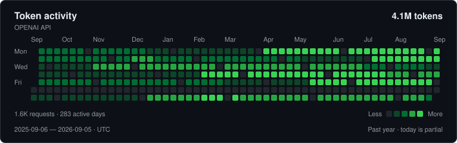

# OpenAI Readme Stats

Dynamically generated OpenAI API usage stats for your GitHub README.

Self-hosted on Cloudflare Workers. No database, frontend, or runtime dependencies. Your admin key stays in your deployment's secret storage and is sent only to OpenAI to retrieve usage.

<picture>
  <source media="(prefers-color-scheme: dark)" srcset="docs/preview-github-dark.svg">
  <source media="(prefers-color-scheme: light)" srcset="docs/preview-github-light.svg">
  
</picture>

*Preview uses synthetic data. Your deployment shows your own usage.*

## Quick start

You need a Cloudflare account and an OpenAI organization admin key with permission to read usage. Organization owners can create admin keys in [OpenAI organization settings](https://platform.openai.com/settings/organization/admin-keys). A normal project API key will not work.

### 1. Deploy your Worker

[](https://deploy.workers.cloudflare.com/?url=https%3A%2F%2Fgithub.com%2FYOUR-USERNAME%2Fopenai-readme-stats)

> Repository publishing setup: replace `YOUR-USERNAME/openai-readme-stats` in the button and clone command with this project's GitHub repository before sharing it. The button needs a published repository; CLI deployment works directly from this directory.

The button clones the repository into your account and deploys it. It can prompt for `OPENAI_ADMIN_KEY` using the included `.dev.vars.example`; supply the secret there or add it in step 2. Keep the Worker name consistent with your local `wrangler.jsonc` if using the CLI afterward.

Or deploy from your terminal with Node.js 22.12+ (Node.js 22 LTS recommended):

```sh
git clone https://github.com/YOUR-USERNAME/openai-readme-stats.git
cd openai-readme-stats
npm ci
npx wrangler login
npm run deploy
```

If you already have this project locally, start with `npm ci`. Deployment without a key succeeds, but the image reports a configuration error until you add the secret.

### 2. Add your admin key

From the project directory:

```sh
npx wrangler secret put OPENAI_ADMIN_KEY
```

Paste the key into Wrangler's prompt. Alternatively, add an encrypted secret named `OPENAI_ADMIN_KEY` under your Worker's **Settings → Variables and Secrets** in Cloudflare, then deploy that settings change. Never put a key in a URL, README, or `wrangler.jsonc`.

### 3. Add to GitHub

Open your deployed `/activity.svg` URL once to verify the card, then add this Markdown:

```md

```

Use the exact hostname printed by Wrangler or the Cloudflare dashboard. `/` intentionally returns 404; `/activity.svg` is the product's only route.

## Appearance

```text
/activity.svg
/activity.svg?theme=light
/activity.svg?theme=dark&hide_border=true
/activity.svg?days=90
```

| Parameter | Values | Default |
| --- | --- | --- |
| `theme` | `dark`, `light`, `github-dark`, `github-light` | Deployment's `THEME` |
| `days` | Integer from 1 to configured `DAYS` | Deployment's `DAYS` |
| `hide_border` | `true`, `false` | `false` |

Unknown or repeated parameters return 400. Theme aliases and parameter ordering share cache entries. Readers cannot change the title, expand the history beyond the configured maximum, or change the project scope.

For a card that follows GitHub's theme, use:

```html
<picture>
  <source media="(prefers-color-scheme: dark)" srcset="https://YOUR-WORKER.workers.dev/activity.svg?theme=dark">
  <source media="(prefers-color-scheme: light)" srcset="https://YOUR-WORKER.workers.dev/activity.svg?theme=light">
  
</picture>
```

## Deployment configuration

Edit `vars` in `wrangler.jsonc`, then redeploy:

| Setting | Default | Meaning |
| --- | --- | --- |
| `OPENAI_ADMIN_KEY` | Required secret | OpenAI organization admin key; set with Wrangler or Cloudflare |
| `DAYS` | `365` | History to fetch and maximum readers may display, 1–365 |
| `THEME` | `github-dark` | Default theme; also accepts `github-light`, `dark`, `light` |
| `TITLE` | `Token activity` | Card heading, up to 48 characters; XML escaped |
| `PROJECT_IDS` | Unset | Optional comma-separated project IDs, up to 20 |

For example, add `"PROJECT_IDS": "proj_abc,proj_def"` to `vars` to publish only those projects' combined activity. Without it, the card publishes organization-wide totals. The endpoint is public: anyone with the URL can see daily tokens and request counts, including exact counts in the SVG source. Choose the intended scope before sharing.

Only your own deployment handles the admin key. This project runs no central service and collects no credentials or telemetry. Cloudflare and OpenAI are the infrastructure providers. The Worker uses a fixed OpenAI API URL, refuses redirects, and does not log keys or upstream response bodies. This is an independent project, not an official OpenAI product.

## What the card measures

Daily activity is `sum(input_tokens + output_tokens)` from the organization's [Completions Usage endpoint](https://developers.openai.com/api/reference/resources/admin/subresources/organization/subresources/usage/methods/completions). Input counts already include cached input; it is not added twice. Request counts come from `num_model_requests` in those same results.

The card covers the last 365 UTC calendar dates including today, with Monday at the top and Sunday at the bottom. Today's data is partial and OpenAI reporting may lag. Missing days display zero; days outside the requested interval are omitted. A typical year has 53 week columns. Shorter histories keep a readable minimum card width.

Color thresholds are the interpolated 25th, 50th, and 75th percentiles of nonzero days. Zero is level 0; a positive value advances a level only when it exceeds a threshold. Equal counts get equal colors. With one positive value or identical nonzero counts, active cells use level 1. Each day's SVG tooltip includes its UTC date, tokens, and requests. The card also includes accessible text and summary totals.

This v0.1 measures the completions usage category, not every OpenAI product. It does not include separate embeddings, images, transcription, or other usage categories, ChatGPT subscription activity, or subscription-based Codex usage. It does not calculate cost. For financial reporting, use OpenAI's [Costs endpoint](https://developers.openai.com/api/reference/resources/admin/subresources/organization/subresources/usage/methods/costs).

## Fetching and caching

On a cold request, the Worker splits the configured UTC interval into nonoverlapping windows of up to 31 days. It fetches three windows concurrently, follows `has_more` / `next_page` within each window, validates and merges the results, fills missing dates, and renders the SVG. A full year normally takes 12 OpenAI requests. Pagination is capped at 24 total requests and the fetch has a 20-second timeout. Failed or incomplete fetches produce an error, never a partially populated success card. There are no automatic retries in v0.1.

Both daily aggregates and rendered SVGs use Cloudflare's ephemeral Cache API. Appearance variants share the aggregate entry, including shorter `days` views; a short view still fetches the configured history on a cold cache. Set `DAYS` lower to reduce that work. This cache needs no KV binding or database.

Fresh cards return:

```http
Content-Type: image/svg+xml; charset=utf-8
Cache-Control: public, max-age=900, s-maxage=3600
```

Variants rendered from cached data have a reduced edge TTL so they expire with their source. Internal cache keys include UTC date, configuration, and a hash incorporating the credential; the plaintext key is never in a cache URL. Rotation changes the internal cache scope. Already published images can remain in GitHub/browser caches until they expire.

The [Cloudflare Cache API](https://developers.cloudflare.com/workers/runtime-apis/cache/) is local to a data center, best effort, and subject to eviction. Simultaneous cold requests can each fetch OpenAI; this is not a global once-per-hour guarantee. GitHub's image proxy also controls its own caching. The client fits within the documented [Workers Free subrequest and connection limits](https://developers.cloudflare.com/workers/platform/limits/); actual CPU consumption and live API latency depend on the deployment and response sizes.

## Local development and verification

```sh
npm ci
npm run check       # TypeScript, mocked Vitest tests, and a local deployment dry run
npm run test:runtime # Build and exercise workerd with intercepted synthetic API responses
npm run preview     # Regenerate both README examples with synthetic data; no key
npm run dev         # Local Worker at http://localhost:8787/activity.svg
```

To test real data locally, copy `.dev.vars.example` to `.dev.vars` and supply your admin key there yourself. `.dev.vars*` and `.env*` are ignored by Git, except the blank example. If both files exist, Wrangler uses `.dev.vars` instead of `.env`. `npm run dev` without a key is useful for checking the route and configuration error SVG. Local checks and CI never require a real key or deploy anything; only `npm run deploy` publishes the Worker.

Tests cover daily aggregation, leap dates and UTC alignment, quartiles, SVG escaping and layout, pagination and concurrency limits, failures and timeouts, configuration, cache reuse and expiry, credential rotation, and route behavior. Unit tests mock OpenAI and cache storage. The runtime smoke test exercises the bundled Worker and its Cache API inside local workerd, intercepting every outbound request with synthetic data; it requires permission to bind localhost ports. CI runs both suites and the Worker bundle dry run on Node.js 22. Live OpenAI access and production cache behavior need verification after you deploy.

```text
src/index.ts       Route, edge cache, safe error responses
src/openai.ts      Usage API requests and pagination
src/aggregate.ts   UTC days, token totals, percentile levels
src/svg.ts         Accessible dark/light SVG cards
src/config.ts      Deployment and URL configuration
test/             Mocked tests and synthetic fixtures
scripts/preview.ts  Generates the README SVG examples
wrangler.jsonc    Cloudflare Worker configuration
```

## Troubleshooting

| Result | Action |
| --- | --- |
| 404 | Use `/activity.svg`, not `/` |
| 400 | Check the supported query parameters and `days` limit |
| 503 configuration message | Set `OPENAI_ADMIN_KEY` and check deployment variables |
| 502 admin key message | Use an organization admin key with usage access; ordinary project keys are insufficient |
| 503 rate limit message | Wait and retry; reduce `DAYS` if needed |
| 504 | OpenAI exceeded the 20-second fetch timeout; retry later |
| Other 502 | Upstream failure, malformed data, or pagination limit; retry later |
| All zeroes | Check project scope, organization, date range, and OpenAI's own Usage dashboard |
| Old GitHub image | Allow for edge and GitHub proxy caching; changing URL appearance may still reuse cached usage |

Errors use an SVG body, a non-2xx status, and `Cache-Control: no-store`. GitHub may show a broken image for an error response; opening the endpoint directly reveals the message. The service supports `GET` and `HEAD`; other methods return 405.

## License

[MIT](LICENSE)
